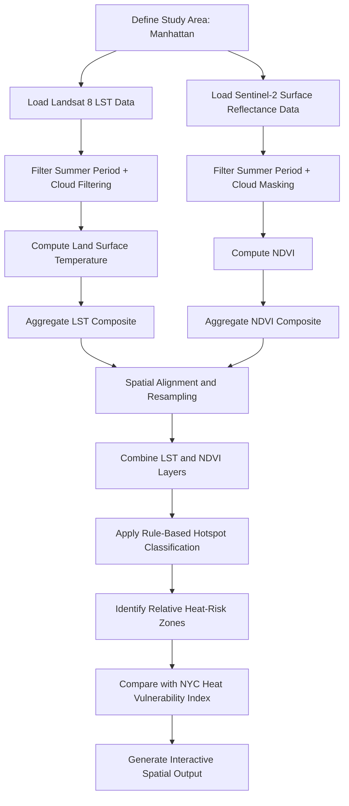

# System Sketch v0

---

## Overview

This system processes satellite-derived environmental datasets to identify neighbourhood-scale urban thermal hotspot patterns across Manhattan.

The analytical workflow integrates Land Surface Temperature (LST) and vegetation density indicators (NDVI) to support spatial prioritisation of urban heat mitigation interventions.

The system is designed as a transparent and reproducible geospatial analysis pipeline rather than a predictive machine learning system.

---

## Pipeline Diagram

---

## Step-by-Step Explanation

### 1. Study Area Definition

* Administrative boundary data is used to isolate Manhattan
* All datasets are clipped to the same geographic extent to ensure spatial consistency

---

### 2. Data Ingestion

### Landsat 8 Surface Temperature Dataset

* Source: Landsat 8 Collection 2 Level 2
* Thermal infrared band used for Land Surface Temperature derivation
* Selected because of strong suitability for urban thermal analysis

### Sentinel-2 Surface Reflectance Dataset

* Source: Sentinel-2 Surface Reflectance
* Red and Near-Infrared bands used for NDVI calculation
* Selected to represent vegetation distribution and density

---

### 3. Temporal and Quality Filtering

* Analysis restricted to June–August 2018 to represent peak summer conditions
* Cloud and atmospheric contamination reduced through filtering procedures

### Filtering Methods

* Landsat:

  * Cloud cover metadata threshold filtering

* Sentinel-2:

  * Scene Classification Layer (SCL)-based cloud masking

---

### 4. Feature Extraction

### Land Surface Temperature (LST)

LST values are extracted from the Landsat thermal band and converted into degrees Celsius.

### Normalized Difference Vegetation Index (NDVI)

NDVI is computed using the normalized difference between Near-Infrared and Red spectral bands.

NDVI acts as a proxy indicator for vegetation presence and density.

---

### 5. Temporal Aggregation

### LST Aggregation

* Mean compositing used to represent overall summer thermal conditions

### NDVI Aggregation

* Median compositing used to reduce cloud contamination and temporal noise

---

### 6. Spatial Integration

* LST and NDVI layers are spatially aligned into a common analytical framework
* Resolution differences between datasets are documented as a limitation
* Combined dataset represents thermal exposure and vegetation conditions simultaneously

---

### 7. Relative Hotspot Classification

A transparent rule-based classification approach is applied:

* High LST + Low NDVI → Relative high-risk hotspot zone
* Low LST + High NDVI → Relative lower-risk zone

The classification system is intended for interpretable prioritisation rather than predictive modelling.

---

### 8. Validation and Contextual Comparison

* Identified hotspot patterns are compared against the NYC Heat Vulnerability Index (HVI)
* Validation is used as a contextual consistency check rather than strict ground-truth verification

---

### 9. Final Output Generation

The system generates an interactive spatial dashboard displaying:

* Land Surface Temperature patterns
* Vegetation distribution
* Relative hotspot classifications
* Priority intervention zones

The output supports planning decisions related to:

* Tree planting
* Urban greening
* Surface material interventions
* Heat mitigation prioritisation

---

## Assumptions

* Land Surface Temperature is an acceptable proxy for urban heat intensity
* NDVI adequately represents broad vegetation distribution patterns
* Summer imagery captures periods of elevated urban thermal stress
* Relative hotspot classification is sufficient for neighbourhood-scale prioritisation

---

## Limitations

* Does not directly measure human thermal comfort
* Does not include humidity, wind, radiation balance, or shading geometry
* Limited to Summer 2018 imagery
* Spatial resolution differences exist between Landsat and Sentinel-2 datasets
* Classification is rule-based and non-predictive
* Results should be interpreted as relative spatial patterns rather than exact street-level measurements

---

## Conclusion

The system provides a reproducible and interpretable geospatial workflow for identifying neighbourhood-scale urban thermal hotspot patterns across Manhattan.

While simplified, the workflow supports evidence-based urban heat mitigation planning using transparent analytical assumptions, satellite-derived environmental indicators, and clearly documented limitations.
